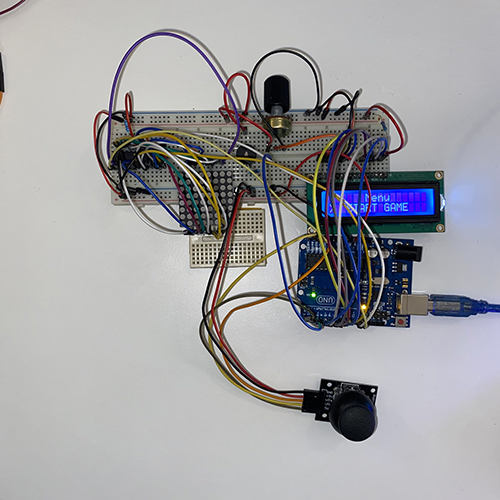
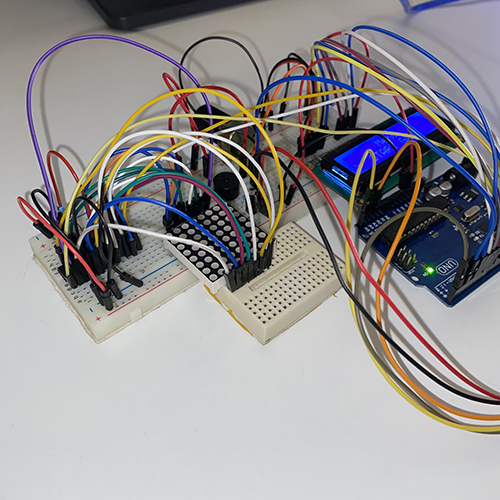

# Snake - MatrixProject

# Backstory

Snake is a very simple game, but it's also very popular. I used to play it on the Nokia 3310 when I was a kid, so I chose to make this game.

# Game Description

I suppose everyone knows how the Snake game Works. 
But if you don't, here's all you need to know to play it:
<li> You are a Snake who is HUNGRY, and you need to Eat so you will not die. </li>
<li> The food will blink on the matrix, so it will be easy to see. </li>
<li> After you Eat the food, the snake lenght and the score will increase </li>

# How to play

  The Game is played using only the <b> Joystick <b>

<h3> Main Menu </h3>
<ul>
<li> START GAME </li> 
    <ul>
      <li>Player Name - Here you can select you name </li>
    </ul>
<li> HIGHSCORE - Here you can see the Leaderboard</li>
<li> SETTINGS </li>
     <ul>
      <li> DIFFICULTY- Here you can select you name </li>
      <li> MATRIX BRIGHTNESS - Select the matrix Brightness</li>
      <li> SOUNDS - Turn Sounds on / off </li>
      <li> RESET HIGHSCORE - Resets the Leaderboard </li>
    </ul>
<li> ABOUT - Game Name and Creator </li>
<li> HOW TO PLAY - Short descriprion on how to play</li>
</ul>

# Used Components

<li> Arduino Uno </li>
<li> Breadboard </li>
<li> 8x8 LED matrix </li>
<li> Matrix driver MAX7219 </li>
<li> 16x2 LCD </li>
<li> Joystick </li>
<li> Buzzer </li>
<li> 10 uF 50V capacitor </li>
<li> 104 ceramic capacitor </li>
<li> One potentiometer </li>
<li> Resistors </li>
<li> Wires </li>

# Images

# Video
[Link to the video!](https://youtu.be/7sEFqCGNVYs)
  

  
 <h6> Bugs </h6> 

  
  <li> Small lag when increasing the snake's length. It won't increase immediately. I see it as an Easter Egg, because you don't grow immediately after you eat, you always need to wait😜</li>
  <li> Sometimes the food changes is position when started the game. </li>
 

